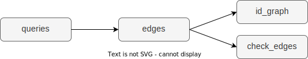

# Models

The primary ouput of this package is `id_graph`. There are a few intermediate models used to create this model.

---

## queries

Creates a [view](https://docs.getdbt.com/terms/view) containing SELECT statements which pull pairs of IDs from your tables.

| sql_to_run |
| --- |
| SELECT DISTINCT email::TEXT AS node_a, 'email' AS node_a_label, user_id::TEXT AS node_b, 'user_id' AS node_b_label FROM db.web.identifies WHERE COALESCE(email::TEXT, '') != '' AND COALESCE(user_id::TEXT, '') != '' |
| SELECT DISTINCT phone::TEXT AS node_a, 'phone' AS node_a_label, user_id::TEXT AS node_b, 'user_id' AS node_b_label FROM db.app.identifies WHERE COALESCE(phone::TEXT, '') != '' AND COALESCE(user_id::TEXT, '') != '' |

## edges

An [incremental model](https://docs.getdbt.com/docs/build/incremental-models) that combines the results of the SELECT statements generated by `queries` to create a table containing pairs of IDs (edges) the first time it is run, and matches edges on subsequent runs.

| rudder_id | original_rudder_id | node_a | node_a_label | node_b | node_b_label | timestamp |
| --- | --- | --- | --- | --- | --- | --- |
| 1 | 1 | user@company.com | email | 123456 | user_id | 2022-12-21 02:48:41.406655 |
| 1 | 2 | 555-555-5555 | phone | 123456 | user_id | 2022-12-21 02:48:41.406655 |

## check_edges

Creates a view that is used to determine if there are still edges to match.

| rows_to_update | consolidation_needed |
| --- | --- |
| 0 | FALSE |

## id_graph

Creates an ID graph table.

| rudder_id | node | label | latest_timestamp |
| --- | --- | --- | --- |
| 1 | user@company.com | email | 2022-12-21 02:48:41.406655 |
| 1 | 123456 | user_id | 2022-12-21 02:48:41.406655 |
| 1 | 555-555-5555 | phone | 2022-12-21 02:48:41.406655 |